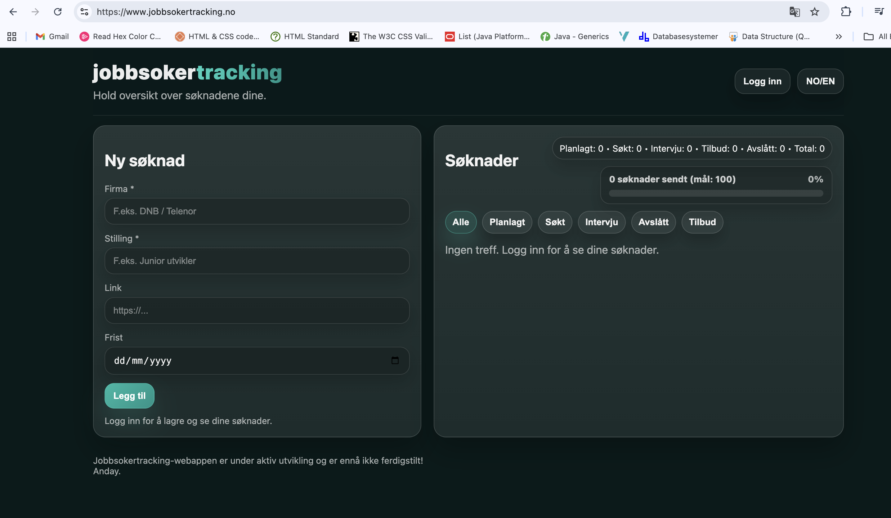
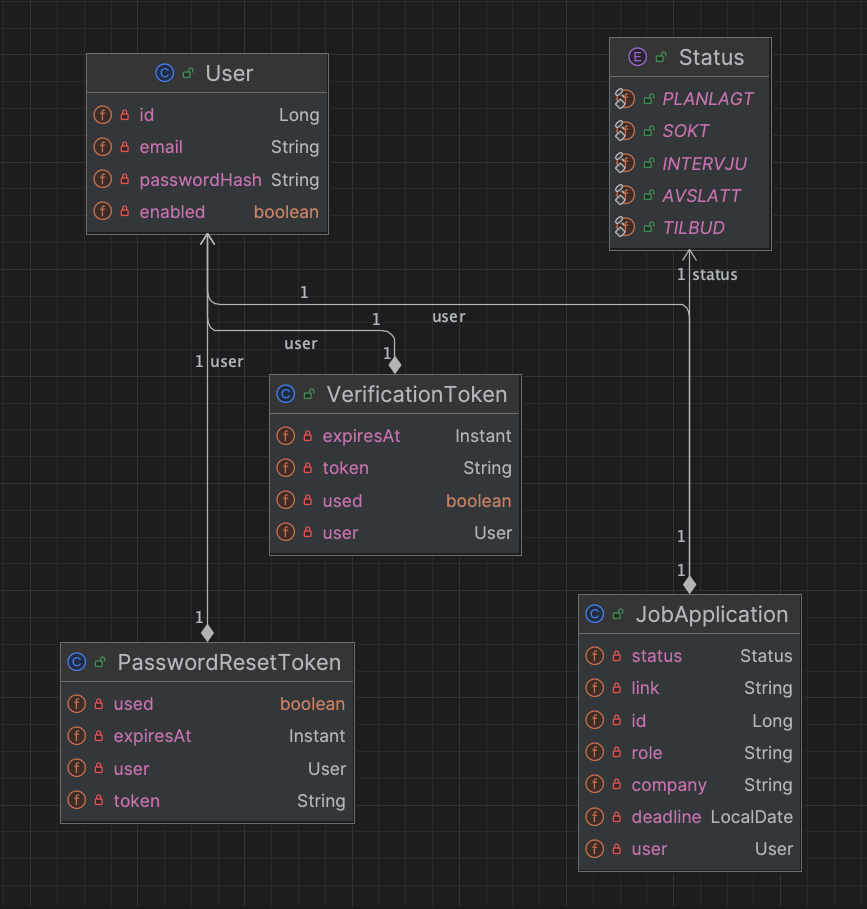
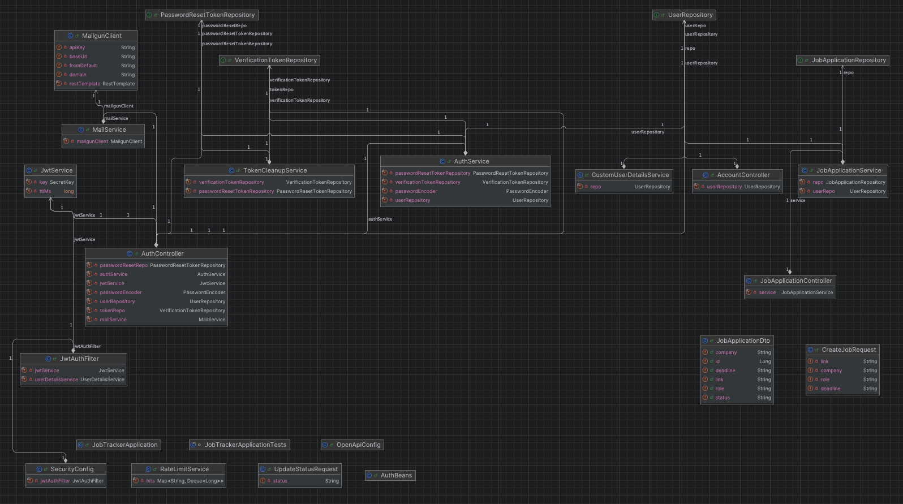
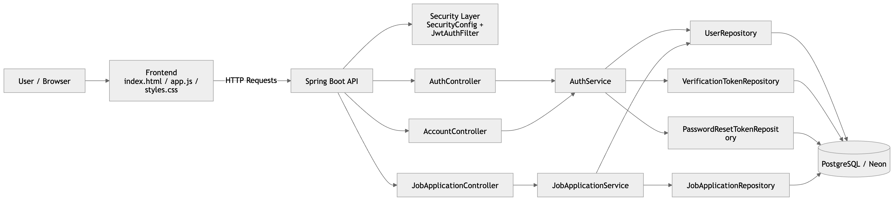

# Jobbsøker Tracker

En fullstack webapplikasjon utviklet for å effektivisere jobbsøkerprosessen ved å gi struktur, oversikt og fremdrift i håndtering av jobbsøknader.

Applikasjonen demonstrerer praktisk erfaring med backend-utvikling, autentisering, databasehåndtering og deploy av produksjonsklar løsning.

Live demo:  
https://www.jobbsokertracking.no  

GitHub:  
https://github.com/Anday2025/jobbsokertracking  


## Oversikt

Applikasjonen gir brukere et oversiktlig dashboard for å registrere, oppdatere og følge status på jobbsøknader. Den inkluderer også statistikk og fremdrift for å gjøre jobbsøkerprosessen mer strukturert.


## Applikasjon




## Funksjonalitet

- Registrering og innlogging (JWT-basert autentisering med cookies)
- E-postverifisering
- Tilbakestilling av passord
- Opprette, oppdatere og slette jobbsøknader
- Filtrering etter status
- Fremdriftsindikator og statistikk
- Støtte for norsk og engelsk språk


## Teknologi

Backend:
- Java 17
- Spring Boot
- Spring Security
- Spring Data JPA

Frontend:
- HTML
- CSS
- JavaScript

Database:
- PostgreSQL (Neon)

Andre:
- Flyway (database migrasjoner)
- JWT (autentisering)
- Mailgun (e-posttjeneste)
- Swagger / OpenAPI (API-dokumentasjon)


## Backend-struktur






## Systemarkitektur




## API

Swagger UI:  
http://localhost:8080/swagger-ui.html  


## Kjør lokalt

```bash
git clone https://github.com/Anday2025/jobbsokertracking.git
cd job-tracker
mvn spring-boot:run
```

## Miljøvariabler 

Applikasjonen bruker miljøvariabler for konfigurasjon av database og e-post. Disse er ikke lagret i koden av sikkerhetshensyn.

- DATABASE_URL=...
- DATABASE_USERNAME=...
- DATABASE_PASSWORD=...
- MAILGUN_API_KEY=...
- MAILGUN_DOMAIN=...
- MAIL_FROM=...
- APP_BASE_URL=http://localhost:8080


## Om

- Utviklet av Anday Semere
- Bachelor i ingeniørfag, data

## Status

- MVP ferdig og deployet
- Under videre utvikling
